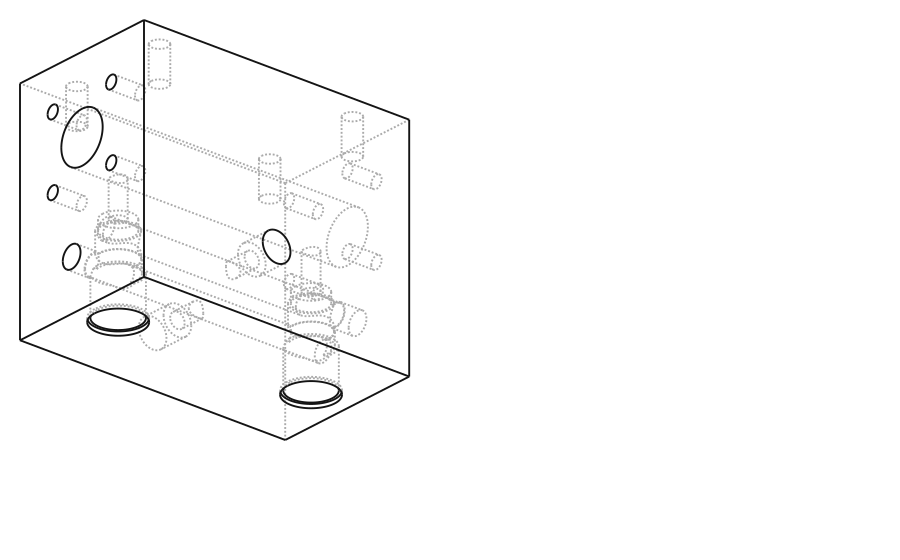

# Hoja de fabricación – Nubelink H1‑B "comando" (bloque integrado de una función, prueba)

Archivo a enviar: `cad/out/nubelink_h1b_comando_bloque.step` (+ esta hoja como PDF/notas). Modelo paramétrico: `cad/nubelink_h1b_comando.py`.

## 1. Qué es

Un solo bloque mecanizado que contiene la camisa del servopistón, las dos cavidades de las válvulas proporcionales, las galerías P/T y las salidas a las cámaras. Se completa con 2 tapas, pistón, vástago, horquilla, paquete de resorte y 2 cartuchos HYDAC PDR08‑01. Es el "comando" de una función; el H2 modular replica este bloque por sección.

## 2. Pieza principal: bloque

| Ítem | Especificación |
|---|---|
| Dimensiones | **110 × 60 × 90 mm** (X × Y × Z), aristas rotas 0,5 × 45° |
| Material | **Aluminio 6061‑T6 o 7075‑T6** (prototipo). Alternativa acero 1045 si se prefiere bruñir la camisa localmente |
| Camisa | **Ø20 H8** (20,000–20,033) pasante en X, eje a z = 30 desde la base, centrado en Y. Escariado/bruñido, **Ra ≤ 0,4 µm**, sin rayas axiales, chaflán 15° × 1 en ambas bocas |
| Cavidades de válvula | 2 × **FC08‑3 (HYDAC) / SAE‑08 3 vías**, desde la cara superior, en x = ±40, y = 0. **Mecanizar según plano oficial HYDAC** (rosca 3/4‑16 UNF‑2B, diámetros de sellado ±0,02, Ra ≤ 0,8, coaxialidad 0,05). El STEP trae un escalonado orientativo, no las cotas finales |
| Galería P | Ø8, eje X, en (y = −5, z = 62), desde la cara −X hasta x = +50 (ciega, fondo cónico admisible). Boca **G1/8** (tapón con junta) en la cara −X |
| Galería T | Ø8, eje X, en (y = +5, z = 70), desde la cara +X hasta x = −50 (ciega). Boca **G1/8** en la cara +X |
| Puerto P | **G1/4** (ISO 1179‑1, con cara plana Ø20 Ra 3,2) en la cara frontal (y = −30), en (x = 0, z = 62); taladro de paso Ø6 hasta la galería P |
| Puerto T | **G1/4** en la cara trasera (y = +30), en (x = 0, z = 70); taladro Ø6 hasta la galería T |
| Salidas A / B | Ø6 verticales desde el fondo de cada cavidad (z = 54) hasta la camisa, en x = ±40. Desbarbar la intersección con la camisa (crítico para el sello del pistón) |
| Tapas | Por cara extrema: **4 × M6 × 12** en PCD 40 alrededor del eje de la camisa, patrón a 45° |
| Base | **4 × M8 × 14** en (x = ±40, y = ±20) |
| Tolerancias generales | ISO 2768‑m; posiciones de cavidades y galerías ±0,1 |
| Acabado | Sin anodizar en el prototipo (el anodizado cambia diámetros); si se anodiza, enmascarar camisa y cavidades |
| Limpieza | Desbarbado total, lavado, soplado, tapar todos los puertos. **Ensayo de presión 60 bar / 5 min** en camisa y galerías (el taller o tu hidráulico) |

Pared mínima entre galería P (30 bar) y la camisa/cavidades ≥ 4 mm; verificado en el modelo (el estudio de tensiones da FS > 80 en aluminio).

## 3. Piezas secundarias (torno local o el mismo taller)

| Pieza | Cant. | Material | Cotas clave |
|---|---|---|---|
| Tapa | 2 | Aluminio 6061 o acero | Brida Ø50 × 10, espiga Ø19,9 × 6 (guía), ranura de O‑ring de cara para **O‑ring 30 × 2** (Ø34 medio, 2,6 ancho, 1,6 prof.), 4 × Ø6,5 en PCD 40, paso Ø10,1, alojamiento de **sello de vástago 10 × 18 × 5** y **guardapolvo 10 × 16 × 4** (cotas según catálogo del sello) |
| Pistón | 1 | Bronce o acero | Ø19,9 × 14, ranura central 4 mm para **aro PTFE (glyd ring) Ø20** + O‑ring energizante, paso Ø10 con asiento y contratuerca M8 (o pistón roscado al vástago) |
| Vástago | 1 | Cromado duro Ø10 f7 (barra comercial) | L 240, extremos **M8 × 18** |
| Horquilla | 1 | Acero | 30 × 16 × 20, ranura 8, perno Ø8, rosca M8 |
| Paquete de resorte | 1 | Acero / aluminio | Espaciador Ø44/Ø30 × 8; caja Ø44 × 48 (interior Ø36, paredes 4 mm con abertura Ø24); 2 arandelas Ø34 × 3; collar Ø18 × 5 fijado al vástago (pasador o rosca); tuerca M8 con cara Ø18. **Resorte de matricería** Ø ext. 25–28, Ø int. ≥ 12, longitud libre ~50 mm, **rigidez ≈ 6 N/mm**, montado con **~7 mm de precarga (≈ 40 N)** |
| Tornillería | — | 8.8 zincada | 8 × M6 × 20 (tapas), 4 × M8 (base), 2 tapones G1/8 con junta, 2 racores G1/4 |

## 4. Cartuchos y bobinas (comprar)

| Ítem | Referencia | Nota |
|---|---|---|
| Válvula proporcional V_A y V_B | **HYDAC PDR08‑01‑C‑N‑30‑24PG** (0–20 bar, 12 L/min, 350 bar) × 2, con bobina 24 V y conector | El rango 0–20 bar (código 30) es el elegido por el estudio en lazo abierto; el 0–14 no llega a fin de carrera con distribuidores de resorte fuerte |
| Alternativa mientras llegan | 2 cuerpos en línea **FH083‑AB3** + mangueras a los puertos A/B… no aplica: en el H1‑B las salidas A/B son internas; usar el bloque directamente |

## 5. Dónde fabricarlo (JLCPCB / PCBWay / taller de manifolds)

| Proceso | ¿Sirve? | Comentario |
|---|---|---|
| **CNC mecanizado** (JLCPCB CNC, PCBWay CNC, Xometry, taller chino de manifolds) en 6061‑T6 | **Sí, es el proceso correcto** | Subir el STEP + esta hoja. Pedir explícitamente: camisa Ø20 H8 Ra 0,4 (escariado + bruñido o lapeado), cavidades FC08‑3 según plano HYDAC (adjuntarlo), roscas G1/4, G1/8, 3/4‑16 UNF, M6, M8, desbarbado y limpieza. Si el servicio online no ofrece roscas BSPP/UNF, pedir los taladros previos (Ø11,5 / Ø8,6 / Ø17,5) y roscar localmente. Pedir **2 piezas** (una de reserva / sacrificio para medir la cavidad) |
| **SLM / impresión en metal** ("impresión en fierro": 316L o AlSi10Mg) | **No para este bloque** | Porosidad residual (fugas a presión sin HIP), rugosidad interna Ra 10–20 µm en galerías, distorsión térmica, y de todos modos hay que mecanizar camisa, cavidades y todas las caras de sellado; termina costando más que el CNC y con más riesgo |
| Fundición | No | Sin sentido para 1–10 piezas |
| Tu CNC 6090 | Parcialmente | Puede hacer el bloque en aluminio (desbaste + galerías + puertos + roscas) si tienes taladros largos y refrigeración; la camisa H8 y las cavidades FC08‑3 requieren escariador/bruñido y herramienta de forma; para el primer bloque conviene encargarlo |

Orden sugerida: CNC online → recibir → verificar cavidad con el cartucho (debe entrar y sellar) → montar sellos y tapas → ensayo 60 bar → banco.

## 6. Check‑list de recepción

1. Camisa: pasa/no pasa Ø20 H8 en tres puntos; sin rayas al tacto; chaflanes.
2. Cavidades: el cartucho PDR08‑01 rosca a mano hasta el asiento; par de apriete el de HYDAC; con 30 bar en P y salida A tapada, sin fuga por la rosca ni hacia T.
3. Galerías: soplar; ninguna viruta; tapones G1/8 con junta.
4. Ensayo de presión: 60 bar 5 min en cada cámara con el pistón montado; sin goteo en tapas ni vástago.
5. Fricción del pistón con A y B abiertos: < 25 N con dinamómetro (objetivo del diseño en lazo abierto).
