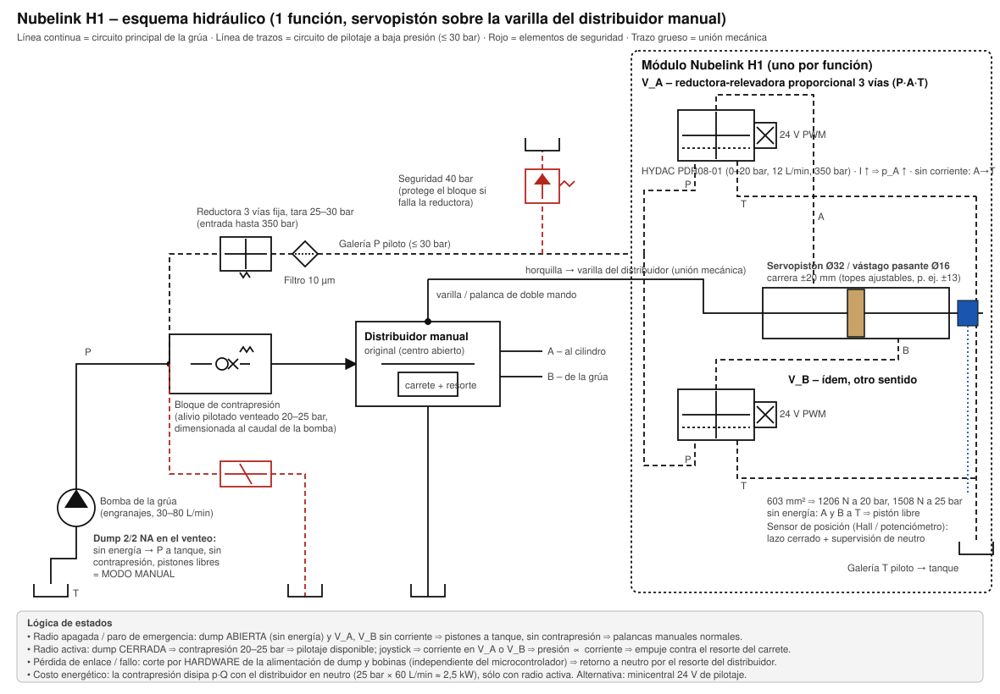
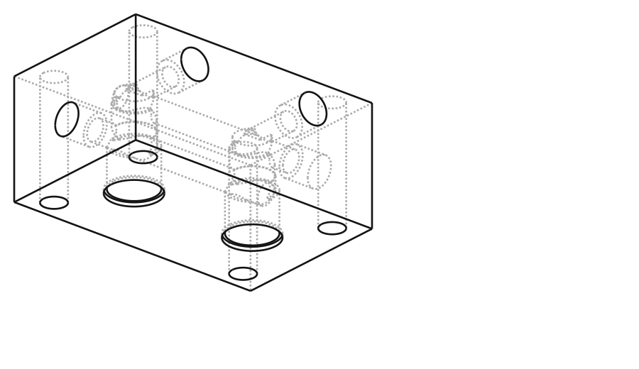
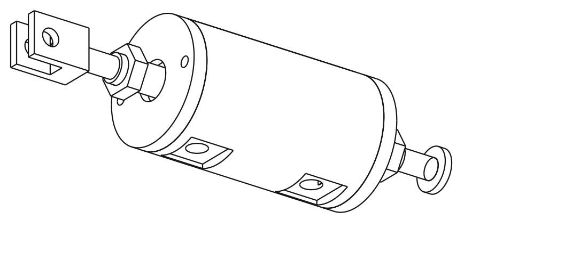
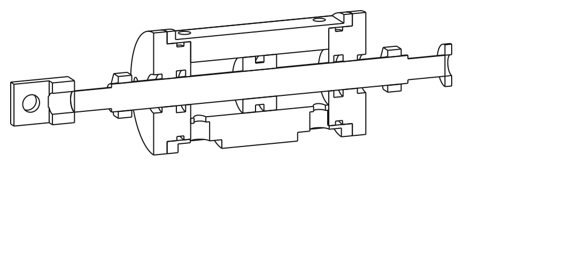

# Nubelink – Análisis del Scanreco MOD10 y especificación del prototipo H1

*Bloque servohidráulico para radiocontrolar grúas cargadoras con distribuidor manual*

Fecha: 2026-09-28 · Estado: concepto de ingeniería para banco de pruebas (no validado para grúa con carga)

---

## 0. Resumen ejecutivo (mi opinión en corto)

1. **El negocio es viable y el "bloque" es la parte fácil.** Lo que Scanreco vende como MOD10 es, hidráulicamente, un conjunto de **pistones de baja presión (≤ 30 bar)** que empujan la varilla de cada palanca, gobernados por **dos válvulas reductoras de presión proporcionales por función**. El pistón y su cuerpo se pueden fabricar en un torno convencional en Bolivia. Lo que **no** conviene fabricar son las válvulas proporcionales: se compran (hay cartuchos con rango 0–20 / 0–35 bar hechos exactamente para esto).
2. **Corrección al enfoque anterior:** la válvula correcta **no es una 4/3 direccional ISO 4401 (CETOP)**. Una direccional controla *caudal* y necesitaría un lazo de posición obligatorio. Lo que usan Scanreco, Danfoss (PVE) y Walvoil para mover un carrete es una **válvula reductora-relevadora proporcional de 3 vías (P·A·T)**: la presión de salida es proporcional a la corriente, y el propio resorte del distribuidor convierte esa presión en posición. Sin corriente, la válvula conecta el pistón a tanque: **falla a neutro por diseño**. Eso es lo que tú llamabas "de dos en dos, adelante y atrás".
3. **El punto que faltaba en el análisis previo: de dónde sale la presión de pilotaje.** Las grúas manuales viejas tienen bomba de engranajes y distribuidor de **centro abierto**: en neutro la línea P está casi a 0 bar, así que no hay con qué empujar los pistones. Scanreco lo resuelve con un **"bloque de contrapresión"** (una retención tarada en la línea principal que crea 25–30 bar) más una reductora y un filtro. Esto define el kit tanto como el bloque de pistones.
4. **Modo manual:** funciona porque, sin energía, ambas cámaras del pistón quedan a tanque y la válvula de descarga (dump) elimina la contrapresión. El operador mueve la palanca arrastrando un pistón libre. Ese es el requisito de diseño n.º 1 del H1 (fricción de sellos baja).
5. **Fabricación:** cuerpo cilíndrico Ø70 × 110 mm en acero C45, camisa Ø32 bruñida, tapas roscadas, vástago pasante Ø16 cromado, puertos G1/4 → **1 206 N a 20 bar / 1 508 N a 25 bar (paridad con el MOD10: 1 300 N)**. Todo torno + taladro. El bloque de válvulas (2 cavidades FC08-3 por función, galerías P/T, salidas A/B) sí es trabajo para la CNC 6090 en aluminio. Galerías cruzadas se cierran con **tapones roscados con sello** o **tapones expansores**, nunca con soldadura ni pernos comunes.
6. **Seguridad:** la cadena de parada (paro de emergencia, pérdida de enlace) debe cortar por **hardware** la válvula de descarga y las bobinas, independiente del microcontrolador. La práctica del sector para radiocontroles de grúa es **PL d / Categoría 3 (ISO 13849-1)** para la función de parada, y EN 12999 es la norma de referencia de la grúa.
7. **Lo que dice la simulación (carpeta `sim/`):** el control "presión ∝ corriente" sin sensor **no sirve** con este pistón: satura a 0,3 A y la histéresis es la mitad de la carrera, porque el resorte del carrete es blando frente a la fricción. Con **sensor de posición y lazo PI** posiciona a ≈ ±0,5 mm en < 100 ms. Y para volver a neutro hacen falta dos cosas: la secuencia **"retorno activo a neutro → dump 0,5 s después"** (el dump retardado del MOD10) y un **paquete de resorte de centrado propio** (≈ 60 N + 2 N/mm) para el caso sin energía. Todo esto ya está en el CAD y en el modelo.
8. **Dinero:** el kit Scanreco RC400 + MOD10 de 4 funciones se vende en ~USD 6 300 (incluye la radio). Tu versión, usando tu propia radio, tiene un costo hidráulico estimado de USD 2 000–3 500 por grúa de 4 funciones (válvulas importadas + bloque local). El margen será menor que el 5× de tu negocio actual, pero abre el mercado de grúas manuales que hoy no puedes atender y el mismo bloque sirve para otras máquinas (perforadoras, forestales, agrícolas).

---

## 1. Qué es exactamente el Scanreco MOD10 (hallazgos)

Fuentes: página oficial del MOD10, ficha de Faber-Com (fabricante del módulo hidráulico), distribuidores Hydraulic-Master, Anderson Controls, Approved Hydraulics (ver §14).

| Característica | Dato publicado |
|---|---|
| Principio | Bloque de **pistones hidráulicos modulares con realimentación mecánica**, cada uno mandado por **un par de electroválvulas proporcionales** |
| Carreras disponibles | **±13 mm** y **±20 mm** (mecánicas) |
| Presión máxima de trabajo | **30 bar** |
| Empuje máximo | **1 300 N** (versión 24 VDC, ±20 mm) |
| Tensión | 12 o 24 VDC, bobinas PWM (repuesto: solenoide proporcional 24 V, agujero Ø14 × 39 mm) |
| Paso entre secciones | 3 opciones (para coincidir con el paso de palancas del distribuidor) |
| Montaje | Soportes atornillados a las **varillas de doble mando**; cada pistón lleva una **horquilla** que se acopla a la varilla |
| Mando manual | "Permanece totalmente funcional y puede usarse en cualquier momento" |
| Alimentación de pilotaje | **Bloques de contrapresión** (p. ej. 70 L/min, ref. A5000020011): "toman parte del aceite del circuito principal y lo ponen a disposición del circuito secundario, a presión reducida". El kit incluye contrapresión, soporte y **filtro** |
| Seguridad | Salida de **válvula de descarga (dump) con apagado retardado** para evitar picos de presión |
| Variante | **HCD-SD**: mismos módulos pero montados directamente en la parte trasera de distribuidores Hydrocontrol HCD y Walvoil SD (sin varillas, sin juego mecánico) |
| Precio de referencia | Kit RC400 de 4 funciones con MOD10: **USD 6 267** (Approved Hydraulics). Incluye emisor PR5MBO26S, receptor, cargador, 2 baterías, bloque de válvulas con bobinas 24 V PWM y "reduce valve 1/2" 100 L/min" |

Lectura de ingeniería de esos datos:

* 1 300 N a 30 bar ⇒ área útil ≈ 430 mm² ⇒ pistón de **Ø24–25 mm** (con vástago). Es decir, el MOD10 usa un pistón casi idéntico al que propongo abajo.
* "Realimentación mecánica" ⇒ el MOD10 no depende sólo del resorte del distribuidor: la posición del pistón se realimenta a la válvula (probablemente un resorte de realimentación al carrete de la reductora, como en un servopiloto). Para Nubelink propongo hacer esa realimentación **electrónica** (sensor de posición + tu receptor), que es más barata de fabricar y además da diagnóstico.
* "Reduce valve 1/2" 100 L/min" y "counter-pressure block 70 L/min" ⇒ son elementos **en la línea principal** (dimensionados al caudal de la bomba), no en el circuito piloto. Confirma la arquitectura de contrapresión.

Lo mismo hacen los fabricantes de distribuidores con pilotaje hidráulico: Danfoss PVE usa 10–15 bar de pilotaje en PVG 32 generados por dos reductoras proporcionales controladas en corriente; el kit de mando remoto de Walvoil usa "un colector con reductora VRP y una válvula montada en el paso de caudal que provee la presión de pilotaje".

---

## 2. Principio físico: por qué reductoras de presión y no una direccional

```
corriente I  ──►  válvula reductora prop.  ──►  presión p = k·I  ──►  fuerza F = p·A
                                                                      │
                            resorte del carrete (F = c·x) ◄───────────┘
                                                                      ▼
                                                     posición del carrete x = p·A / c
```

* **Equilibrio de fuerzas:** el pistón empuja con p·A; el resorte de centrado del distribuidor devuelve con c·x. El carrete se detiene donde ambas fuerzas se igualan. Posición ∝ presión ∝ corriente. No hace falta lazo cerrado para que sea proporcional.
* **Falla a neutro:** una reductora-relevadora de 3 vías, sin corriente, conecta su salida (A) a tanque (T). Ambas cámaras a tanque ⇒ el resorte del distribuidor lleva el carrete a neutro y arrastra el pistón. Con una 4/3 direccional esto exigiría una posición central especial, válvulas de flotación adicionales y un lazo de posición que, si falla, deja el carrete donde estaba.
* **Dos válvulas por función** (una por cámara): es la disposición de Scanreco, Danfoss y Walvoil. Un joystick de 4 funciones ⇒ **8 válvulas**, exactamente lo que observaste.
* **Histéresis:** viene de la fricción del carrete del distribuidor, del pistón y de la propia válvula. Se reduce con *dither* (100–250 Hz superpuesto al PWM), sellos de PTFE en el pistón y, en la versión final, con el lazo de posición.

Cómo llamar a la válvula al cotizar: **"válvula reductora-relevadora de presión proporcional, 3 vías, cartucho, rango 0–20 bar (o 0–35 bar), bobina 24 V"** (inglés: *proportional pressure reducing/relieving valve, 3-way, cartridge*). No es una "2 vías 3 salidas" ni una "3/2".

---

## 3. Alimentación de pilotaje: el problema del centro abierto

| Situación de la grúa | Presión disponible en P con palancas en neutro | Solución |
|---|---|---|
| Bomba de engranajes + distribuidor de centro abierto (la mayoría de las grúas manuales antiguas) | ≈ 3–10 bar (sólo pérdidas de carga) | **Bloque de contrapresión**: retención tarada 25–30 bar en la línea P antes del distribuidor, con la toma de pilotaje aguas arriba. Se desactiva (by-pass) con la válvula de descarga cuando la radio está apagada |
| Bomba de caudal variable *load-sensing* + distribuidor de centro cerrado (Danfoss PVG, Hiab/Palfinger modernas) | 20–30 bar de *standby* permanentes | Toma directa + reductora 30 bar. (Estas grúas normalmente ya tienen electroválvulas; no es tu caso de uso) |
| Cualquiera | — | **Minicentral eléctrica 24 V** de pilotaje (bomba pequeña 1–2 L/min, 35 bar, tanque propio o del camión + acumulador 0,5 L). Evita el calor de la contrapresión y no toca la línea principal, pero exige válvulas de **accionamiento directo con baja fuga** (los cartuchos pilotados consumen 0,3–0,5 L/min cada uno de forma continua) |

Costo energético de la contrapresión (sólo con radio activa y palancas en neutro), calculado en `calc/dimensionado_h1.py`:

| Caudal bomba (L/min) | 20 bar | 25 bar | 30 bar |
|---|---|---|---|
| 30 | 1,0 kW | 1,2 kW | 1,5 kW |
| 60 | 2,0 kW | 2,5 kW | 3,0 kW |
| 80 | 2,7 kW | 3,3 kW | 4,0 kW |

Es calor que va al aceite. Scanreco lo acepta porque sólo ocurre mientras se usa el radiocontrol. Recomendación: tarar la contrapresión al mínimo que garantice la carrera completa (según medición del resorte, probablemente 20–25 bar) y que el dump abra siempre que la radio esté apagada.

Esquema completo de un módulo con su alimentación: [`esquema_hidraulico_h1.svg`](esquema_hidraulico_h1.svg)



---

## 4. Arquitectura Nubelink propuesta

| Bloque | Se fabrica / se compra | Comentario |
|---|---|---|
| **Servopistón** (cuerpo, tapas, pistón, vástago, horquilla) | **Fabricar** (torno) | Es el "bloque" que quieres. Baja presión, geometría simple |
| Válvulas proporcionales (2 por función) | Comprar | Ver §6 |
| Cuerpos de válvula (cavidades) | Comprar *line bodies* para H1; mecanizar bloque de 2·n cavidades en aluminio en H2 | Las cavidades exigen herramienta de forma y tolerancias ±0,02 mm; no es trabajo para empezar en la 6090 |
| Bloque de contrapresión + reductora fija 30 bar + filtro 10 µm + dump 2/2 NA + alivio 40 bar | Comprar (cartuchos estándar) | Un solo "bloque de alimentación" por grúa; en H2 se puede integrar en el manifold |
| Soportes y horquillas a las varillas | Fabricar (CNC 6090 en aluminio / acero cortado) | Cambian en cada modelo de grúa |
| Sensor de posición (opcional en H1, recomendado en producto) | Comprar | Hall lineal o potenciómetro 0–50 mm |
| Electrónica | **Tu receptor actual** + salidas en corriente | Ver §8 |

Camino alternativo más corto para algunas grúas: si el distribuidor es Walvoil SD, Hydrocontrol HC-D, Nordhydraulic o Danfoss PVG y el fabricante ofrece **tapas de pilotaje hidráulico** de fábrica, no hacen falta pistones ni horquillas: se cambian las tapas del carrete y se conecta el mismo bloque de válvulas proporcionales (es lo que hace Scanreco con HCD-SD). Vale la pena identificar qué distribuidores tienen tus clientes.


## 4A. Diseño del sistema completo (de la manguera de la grúa al pistón)

Lo que sigue es la cadena hidráulica tal como iría instalada, con tamaños de puerto para que adaptes las mangueras.



| # | Elemento | Especificación | Puertos | Se fabrica / se compra |
|---|---|---|---|---|
| 1 | **Entrada desde la bomba** | Línea P de la grúa. Grúas de 12–20 tm: Palfinger PK 15500 → 300 bar máx., 40 L/min (60 con radio + LS); Hiab V91 = centro cerrado LS, V80 = centro abierto. Diseñar todo lo que ve esta línea a **350 bar** y **100 L/min** | Manguera ½" o ¾" de la grúa → racor adaptador → **G3/4** del bloque | Compras racor; tú adaptas |
| 2 | **Bloque de alimentación** (acero) | Cuerpo con 4 cavidades: (a) alivio pilotado **venteable** tarado 20–25 bar en la línea P (contrapresión), (b) electroválvula 2/2 **normalmente abierta** 24 V en el venteo de (a), (c) reductora fija 3 vías 350 → 25 bar sobre la toma de pilotaje, (d) alivio 35–40 bar sobre la galería piloto. Filtro de presión 10 µm externo en línea | P_IN **G3/4**, P_OUT **G3/4** (al distribuidor), PIL **G1/4**, T_PIL **G1/4**, manómetro G1/4 | Cartuchos: comprar. Cuerpo: comprar manifold estándar o mecanizar en acero (cavidades con herramienta de forma) |
| 3 | **Lógica de la contrapresión** | Sin corriente el venteo está abierto → el alivio abre a 2–4 bar → sin contrapresión, sin calor, pistones libres (**modo manual**). Con corriente el venteo se cierra → 20–25 bar en P mientras el distribuidor esté en neutro → pilotaje disponible. Una válvula SAE-08 gobierna así todo el caudal de la bomba; el "apagado retardado" del MOD10 se hace en tu receptor (mantener 0,5 s la señal antes de soltar) | — | — |
| 4 | **Líneas piloto** | Mangueras ¼" 2 alambres, P_pil y T_pil, del bloque de alimentación al bloque de válvulas. T_pil va al tanque por línea propia, **no** al retorno del distribuidor | G1/4 | Compras |
| 5 | **Bloque de válvulas** (por función) | Aluminio 6082-T6 / 7075-T6, 100 × 60 × 45 mm, **2 cavidades FC08-3** (HYDAC PDR08-01), galería P (anillo 2) y galería T (anillo 3) pasantes por ambas cavidades entrando por las caras extremas como puertos → **sin tapones**; salidas A y B desde la nariz (puerto 1) a la cara frontal; 4 × Ø9 de fijación. Modelo: `cad/nubelink_h1_bloque_valvulas.py` | P, T, A, B: **G1/4** | **Tú lo fabricas** (CNC 6090). Cavidad FC08-3 según plano oficial HYDAC con herramienta de forma; o, para el H1, 2 cuerpos HYDAC **FH083-AB3** (aluminio, G3/8, 210 bar, ref. 3011427) |
| 6 | **Válvulas** | 2 × **HYDAC PDR08-01-C-N-30-24PG** (0–20 bar) por función; alternativa código 50 (0–35 bar). 12 L/min, 350 bar de entrada, accionamiento directo, cavidad FC08-3 | — | Compras |
| 7 | **Servopistón** | Ø32 / Ø16, ±20 mm, 1 206 N a 20 bar (§5) | A, B: **G1/4** | **Tú lo fabricas** (torno) |
| 8 | **Acople** | Horquilla M12 con perno Ø10 + abrazadera partida sobre la varilla de doble mando; tuercas tope para ±13 / ±20 mm | — | Tú (6090 / torno) |
| 9 | **Sensor** (fase 2) | Hall lineal o potenciómetro 0–50 mm en el extremo libre del vástago | — | Compras |

**¿Hace falta la contrapresión en tu grúa?** Depende del distribuidor; hay que **medir la presión en P con las palancas en neutro y el motor en marcha**:

| Distribuidor | Presión en P en neutro | Alimentación piloto |
|---|---|---|
| Hiab **V80**, Walvoil, Hydrocontrol (centro abierto, bomba fija) | ≈ 0–10 bar | Contrapresión obligatoria (elementos 2–3) |
| Hiab **V91** (centro cerrado, *load sensing*) | *standby* LS, típico 20–30 bar (verificar) | Probablemente toma directa con reductora, sin contrapresión |
| Danfoss **PVG 32** (Palfinger PK, Fassi, HMF…), bomba fija con PVP centro abierto | *standby* ≈ 10–15 bar (es la presión con la que trabajan sus PVE) | Con Ø32/Ø16 dan 600–900 N: puede bastar; si no, contrapresión |

Si en tu primera grúa mides ≥ 20 bar en neutro, el bloque de alimentación se reduce a reductora + filtro + alivio + una 2/2 de corte (mucho más barato).

### Bloque de válvulas: qué fabricas y qué no

* **El cartucho PDR08-01 no se fabrica**: carrete y camisa lapeados a micras, resorte calibrado, tubo y bobina emparejados. Cualquier intento casero da histéresis y fugas que arruinan la proporcionalidad.
* **El bloque con las cavidades sí**: es aluminio, 30 bar, y las cavidades FC08-3 se hacen con una herramienta de forma (la vende HYDAC/HydraForce o cualquier fabricante de herramientas de cavidades) en una fresadora rígida. La 6090 puede hacer el bloque, las galerías y los puertos; para las cavidades, prueba en una pieza de sacrificio y mide los diámetros de sellado (tolerancia del orden de ±0,02 mm). Si no llegas, manda sólo la operación de cavidad a un taller.
* **Bobinas**: la PDR08-01 usa bobina HYDAC tipo 24PG; si tus solenoides son de otra marca no son intercambiables (diámetro y largo del tubo). En el pedido, cotiza cartucho + bobina + conector.
* Una vez validado el H1, el bloque de 2 cavidades se replica **por sección** en el H2 (paso de sección = paso de varillas; PVG 32 = 48 mm por módulo) y se le añaden las galerías P/T pasantes con O-ring entre secciones.

---

## 5. Especificación del prototipo H1 (1 función, banco de pruebas)

Modelo 3D paramétrico: [`../cad/nubelink_h1.py`](../cad/nubelink_h1.py) · STEP/STL en [`../cad/out/`](../cad/out/)





### 5.1 Parámetros principales

| Parámetro | Valor H1 | Nota |
|---|---|---|
| Tipo | Cilindro de doble efecto, **vástago pasante** (áreas iguales en ambos sentidos) | Un extremo lleva la horquilla; el otro, el porta-imán del sensor y las tuercas tope |
| Camisa | **Ø32 H8** (32,000–32,039), bruñida Ra 0,2–0,4 µm | Tu hidráulico bruñe cilindros; es trabajo rutinario. Tubo bruñido Ø32 también es medida estándar |
| Vástago | **Ø16 f7**, cromado duro (barra de vástago comercial) o inox AISI 431 pulido | Extremos roscados M12 |
| Área útil | **603 mm²** | π/4·(32² − 16²) |
| Presión de trabajo / ensayo | 20–25 bar de pilotaje (máx. 30) / **60 bar** de ensayo | Alivio del bloque a 35–40 bar |
| Empuje | 603 N @ 10 bar · **1 206 N @ 20 bar** · 1 508 N @ 25 bar · 1 810 N @ 30 bar | Paridad con el MOD10 (1 300 N) a sólo 21,6 bar |
| Carrera | **±20 mm** mecánica (igual al MOD10 largo); **tuercas tope** ajustables para ±13 mm (MOD10 corto) u otra | Cámara interior 82 mm; el pistón de 20 mm nunca tapa los puertos |
| Volumen por media carrera | 12,1 cm³ | Caudal para llenar en 0,3 s: 2,4 L/min por función (PDR08-01 admite 12 L/min) |
| Cuerpo | Barra redonda **Ø70 × 110 mm, acero C45 (SAE 1045)** | Aluminio 7075-T6 posible (0,94 kg vs 2,63 kg); para H1 prefiero acero por roscas y desgaste de camisa |
| Tapas (×2, iguales) | Roscadas **M56×1,5**, espiga 14 mm con O-ring 52×3, brida Ø70 × 8 mm, 2 agujeros Ø6 para llave de espigas | Alternativa CNC: tapa atornillada con 4×M8 |
| Sellos | Pistón: **aro PTFE (glyd ring) Ø32 + O-ring energizante** (baja fricción); vástago: sello PU 16×24×5,5 + guardapolvo 16×22×5 en cada tapa | Alojamientos según catálogo del sello elegido (Hallite, Trelleborg, Parker, o equivalente disponible) |
| Puertos | **2 × G1/4** (A y B) sobre caras planas 26 × 26 mm fresadas, taladro de paso Ø7 a la cámara | Posición axial ±35,5 mm desde el centro |
| Montaje | Cara plana inferior 100 × 36 mm con **4 × M8** (80 × 24 mm) | O abrazaderas partidas sobre el Ø70 (hechas en la 6090) |
| Horquilla | Clevis 34 × 20 × 24 mm, ranura 10 mm, perno Ø10, roscada M12 al vástago | Se adapta a cada varilla de grúa; MOD10 usa el mismo esquema horquilla + abrazadera en la varilla |
| Sensor | Imán en disco Ø24 en el extremo trasero + sensor Hall lineal fijo al cuerpo; o potenciómetro lineal 0–50 mm | Salida 0–5 V / 0,5–4,5 V al receptor |
| Resorte de centrado propio | Paquete tipo carrete en el extremo trasero: caja Ø44 × 48 mm con dos paredes (aberturas Ø30), dos arandelas Ø34, resorte precargado **≈ 60 N + 2 N/mm**, collar en el vástago y tuerca | Garantiza el retorno a neutro sin energía aunque el distribuidor tenga resorte débil o el carrete esté sucio (simulación S6). Cuesta ≈ 100 N más en la horquilla a fin de carrera en modo manual |
| Masa estimada | ≈ 3,8 kg con vástago, horquilla y paquete de resorte (acero); ≈ 2,0 kg en aluminio | |

### 5.2 Tolerancias y acabados críticos

* Concentricidad camisa – alojamiento de tapa – paso de vástago: ≤ 0,05 mm (mecanizar camisa y roscas de tapa en la misma sujeción).
* Camisa Ø32 H8, sin rayas axiales; entrada con chaflán 15° para no dañar el aro PTFE.
* Vástago Ø16 f7, Ra ≤ 0,2 µm, chaflanes en extremos y roscas.
* Caras de puertos: planas, Ra ≤ 3,2, perpendiculares al taladro (ISO 1179-1 para G1/4 con junta).
* Limpieza interior: desbarbar todos los cruces, lavar, soplar; tapar puertos hasta el montaje.

### 5.3 Fuerza necesaria vs. distribuidor (a confirmar con medición; ejemplo con 250 N de resorte + 50 N de fricción, margen ×1,3)

| Camisa / vástago | Área (mm²) | p mínima para 250 N + 50 N | p con margen ×1,3 | Uso del rango 0–20 bar | Uso del rango 0–35 bar |
|---|---|---|---|---|---|
| Ø20 / Ø10 | 236 | 12.7 bar | 16.6 bar | 83 % | 47 % |
| Ø25 / Ø12 | 378 | 7.9 bar | 10.3 bar | 52 % | 29 % |
| Ø28 / Ø14 | 462 | 6.5 bar | 8.4 bar | 42 % | 24 % |
| **Ø32 / Ø16** | 603 | 5.0 bar | 6.5 bar | 32 % | 18 % |

Regla: elegir área y rango de válvula de modo que la **carrera completa se alcance usando el 30–80 % del rango de presión de la válvula** (resolución sin saturar). Con Ø32/Ø16 y la HYDAC de **0–20 bar** (código 30) cubres desde distribuidores livianos (100 N) hasta pesados (600 N a 10 bar) sin cambiar nada; si un distribuidor exigiera más de 1 200 N se pasa al código 50 (0–35 bar). El empuje máximo se limita por software (I_max), no por hardware, así que sobredimensionar el pistón no cuesta precisión.

---

## 6. Válvulas proporcionales comerciales candidatas

Requisito: reductora-relevadora proporcional **3 vías**, cartucho, **rango de presión regulada 0 → 20–35 bar**, entrada ≥ 50 bar (≥ 350 bar si se conecta antes de la reductora fija), caudal ≥ 4 L/min, bobina 24 V ≤ 1 A, PWM 100–400 Hz según ficha, baja fuga interna.

| Válvula | Datos verificados | Comentario |
|---|---|---|
| **HYDAC PDR08-01** | 3 vías, **accionamiento directo**, cartucho SAE-08 (cavidad **FC08-3**), **12 L/min**, entrada 350 bar. Cuerpo en línea de aluminio FH083-AB3 (G3/8, 210 bar, ref. 3011427). Rangos por código: **20 = 0–14 bar, 30 = 0–20 bar, 50 = 0–35 bar**, 110 = 0–75, 200 = 0–138. Bobina 24 V (ej. `PDR08-01-C-N-50-24PG`) | **Primera opción**: rango exacto para pilotaje, directo (poca fuga), cavidad SAE-08 3W común, cuerpos en línea disponibles |
| **Wandfluh MPPPM22** | Cartucho M22×1,5 (ISO 7789), directo por carrete piloto, P hasta 400 bar, 24 V: corriente límite 680 mA | Suiza, muy buena calidad; verificar rangos bajos en ficha 2.3-641 |
| **Sun Hydraulics PRDM / PRDF** | Reductora-relevadora electroproporcional de accionamiento directo, consumo piloto ~0,4 L/min, recomiendan amplificador con control de corriente y dither 100–250 Hz | Ojo: PRDM es "presión **baja** al subir la corriente" (inversa); para esta aplicación se necesita la variante "presión sube con corriente". Verificar rango |
| HydraForce TS10-36 | Rangos **6,9–117 / 159 / 207 bar**, alivia ~6,9 bar sin corriente, 24 V: 0,55 A | **No recomendada**: rango demasiado alto (usarías el 10–15 % de la escala) y 6,9 bar residuales sin corriente |
| Parker (serie proporcional reductora) | 24 V, 0,365 A, PWM 200–600 Hz (preferido 400 Hz) | Verificar rangos bajos |
| **Repuesto original Scanreco/Faber-Com** | Solenoide proporcional 24 V PWM Ø14 × 39 mm para válvula MOD10; Faber-Com vende repuestos | Opción pragmática para el H1: comprar 2 válvulas de repuesto del MOD10 y garantizar rango/fuga correctos |

Elementos del bloque de alimentación (todos cartuchos estándar): reductora-relevadora fija 3 vías 30 bar (entrada 350 bar), válvula de retención tarada 25–30 bar para el caudal de la bomba (contrapresión), electroválvula 2/2 **normalmente abierta** 24 V (dump), alivio 40 bar, filtro de presión 10 µm (β ≥ 75), manómetro.

---

## 7. Fabricación: tu propuesta y mis ajustes

| Tu idea | Mi opinión |
|---|---|
| Hacer el primer bloque en torno | **Sí.** Por eso el H1 es cilíndrico: cuerpo, tapas, pistón y vástago son 100 % torno (más un taladro para puertos y montaje) |
| Taladrar de lado a lado y comunicar con perforaciones transversales | Es el método estándar de los colectores hidráulicos. En H1 no hace falta (las cámaras se alimentan por los puertos radiales). En H2 (bloque modular) sí, con galerías P y T pasantes selladas con O-ring entre secciones |
| Cerrar las perforaciones sobrantes con soldadura | **No.** Distorsiona la camisa y las roscas, deja escoria y tensiones, y no permite reabrir para limpiar. |
| Tapar con pernos | **No.** Un perno común no sella ni está pensado para presión. Usar **tapones roscados G1/4 o SAE ORB con junta (Dowty / O-ring)**, que hay en cualquier casa hidráulica boliviana, o **tapones expansores (Lee / Koenig)** en producción. A 30 bar cualquiera de los dos sobra. |
| CNC 6090 de 2,2 kW | Para **aluminio**: abrazaderas, soportes, porta-sensores, caras planas de puertos, y más adelante el manifold de cavidades (con herramienta de forma y verificación de tolerancias). **No** para tornear la camisa ni para acero grueso: eso va al torno y al bruñido |
| Fundición / China | Para el H2 modular en volumen, un bloque de aluminio 6061-T6/7075-T6 mecanizado (los talleres de manifolds chinos lo hacen bien y barato con tus STEP). Fundición no aporta nada a estos volúmenes |

Presión y materiales: el bloque piloto trabaja a ≤ 30 bar. La tensión en el cuerpo Ø70/Ø32 a 30 bar es ≈ 2,5 MPa (factor de seguridad > 100 en acero; > 90 en aluminio 6061-T6). Incluso si fallara la reductora y llegaran 350 bar, el cuerpo aguanta (FS ≈ 10–17); lo que fallaría serían sellos y roscas de tapa, por eso el alivio de 35–40 bar es obligatorio. Los manifolds de aluminio 6061-T6 comerciales están certificados a 210 bar continuos / 840 bar de rotura; el bloque de alimentación, que ve la línea principal, va en acero.

Secuencia sugerida para el H1:

1. Comprar vástago cromado Ø12, sellos, O-rings y 2 válvulas + cuerpos en línea.
2. Tornear cuerpo (camisa con sobre-medida 0,1–0,15 mm para bruñido), roscas de tapa y caras.
3. Bruñir camisa a Ø32 H8. Taladrar puertos y montaje. Desbarbar y limpiar.
4. Tornear tapas y pistón según el sello comprado (medidas de alojamiento del catálogo).
5. Montar, probar a 60 bar en banco, medir fricción.

---

## 8. Control y electrónica (tu receptor)

Por función se necesitan **dos salidas en corriente** (no en tensión: la resistencia de la bobina sube ~40 % en caliente y el mando se desplazaría):

| Parámetro | Valor de partida |
|---|---|
| Corriente | 0–0,7 A (ajustar I_min de arranque e I_max según válvula) |
| Frecuencia PWM | 100–200 Hz (HYDAC/Sun) o 400 Hz + dither separado (Parker); seguir la ficha |
| Dither | 100–250 Hz, amplitud 5–10 % de I_max, ajustable |
| Rampas | Subida 0,1–0,5 s, bajada 0,1–0,3 s, ajustables por función |
| Curva joystick | Zona muerta ±5 %, curva progresiva |
| Enclavamiento | Nunca energizar V_A y V_B a la vez |
| Supervisión | Corriente real vs. consigna (bobina abierta/en corto), tensión de batería, temperatura |
| Habilitación | Una salida "sistema activo" para la válvula de descarga, alimentada a través de la **cadena de seguridad por hardware** (paro de emergencia, *watchdog*, pérdida de enlace): sin esa cadena cerrada no hay 24 V ni para el dump ni para las bobinas |
| Secuencia de paro / soltar joystick | 1) consigna de posición = 0 en lazo cerrado (retorno activo, ~0,3 s); 2) cuando \|x\| < 1 mm o a los 0,5 s, abrir dump y cortar bobinas. Paro de emergencia: igual pero con límite 0,3 s; si el sensor está en falla, dump inmediato |
| Realimentación (**obligatoria**) | Entrada analógica por función (sensor 0–5 V); lazo PI de posición a 1 kHz (Kp ≈ 0,015 A/mm, Ki ≈ 0,25 A/(mm·s) de partida); alarma si el pistón no vuelve a neutro ±1 mm en 0,5 s tras soltar. La simulación (`sim/out/resultados.md`) muestra que sin sensor el módulo satura a 0,3 A y tiene ~50 % de histéresis |

Para el banco de pruebas basta un driver de dos canales en corriente (o el propio receptor en modo de prueba) y una fuente 24 V / 5 A.

---

## 9. Seguridad: lo que no se puede omitir

1. **Estado seguro sin energía.** Válvulas sin corriente ⇒ A y B a tanque; dump abierta ⇒ sin contrapresión. El resorte del distribuidor **más el paquete de resorte propio del módulo** centran el carrete. La simulación S3/S6 muestra que el resorte del distribuidor solo no basta si hay fricción alta (carrete sucio, 120 N) o resortes débiles (35 N en la horquilla): el paquete propio de 60 N + 2 N/mm lo resuelve en ~0,3 s. Verificar en banco (fricción objetivo < 40 N; PTFE en pistón y vástagos).
2. **Cadena de parada independiente del software.** Relé de seguridad o circuito discreto que corte la alimentación de dump y bobinas por: paro de emergencia en el emisor, pérdida de enlace (> 0,5 s), *watchdog* del micro, selector manual/remoto. Objetivo **PL d / Categoría 3** para la función de parada (referencia del sector para radiocontroles de grúa). Documentar con ISO 13849-1.
3. **Un solo puesto de mando activo.** Selector físico manual/remoto. En remoto, las palancas siguen accesibles (Scanreco lo permite) pero el procedimiento debe exigir que nadie opere las palancas con la radio activa. Como respaldo mecánico duro: **perno de desacople rápido** en cada horquilla.
4. **Presión piloto limitada.** Reductora + alivio 40 bar + mangueras de 2 alambres. Sin esto, una falla de la reductora manda 300 bar a un bloque de sellos de baja presión.
5. **Carrera limitada mecánicamente** (tuercas tope) para no forzar el carrete contra su tope interno.
6. **Supervisión de neutro** con el sensor de posición (fase 2): si tras soltar el joystick el pistón no vuelve a ±1 mm, abrir dump y alarmar.
7. **Filtración 10 µm** y limpieza del bloque antes de conectar: las válvulas proporcionales se traban con contaminación y un carrete trabado es un movimiento no comandado.
8. **Normas de referencia:** EN 12999 (grúas cargadoras), ISO 13849-1 (partes de mando relacionadas con la seguridad), ISO 4413 (seguridad en sistemas hidráulicos). No hace falta certificar para empezar el banco, pero el diseño debe poder demostrar estos puntos si un cliente o aseguradora lo pide.

---

## 10. Banco de pruebas y protocolo H1

Banco: bomba de 5–10 L/min a 50 bar (o la unidad de tu hidráulico con reductora), filtro 10 µm, bloque de alimentación (§6), módulo H1, carga simulada (palanca con resorte ajustable + dinamómetro) o, mejor, un distribuidor manual real desmontado con su resorte, manómetros en P, A y B, fuente 24 V, driver de corriente, registrador (el propio receptor o un Arduino de banco).

| N.º | Ensayo | Criterio |
|---|---|---|
| T1 | Presión estática 60 bar, 5 min, ambas cámaras | Sin fugas, sin deformación |
| T2 | Fricción: fuerza para mover el pistón con A y B a tanque | < 40 N en todo el recorrido |
| T3 | Característica estática corriente → presión de cada válvula (10 puntos subida y bajada) | Lineal ±5 %, histéresis < 5 % con dither |
| T4 | Posición vs. corriente contra resorte (simulado o distribuidor real) | Carrera completa con ≤ 80 % del rango; zona muerta y resolución documentadas |
| T5 | Respuesta a escalón 0 → 100 % y 100 → 0 | 90 % de carrera en ≤ 0,3–0,5 s; sin sobrepaso mayor a 10 % |
| T6 | Falla segura: corte de alimentación a carrera máxima; apertura del dump | Retorno a neutro < 0,5 s; fuerza manual en palanca con dump abierto ≤ +30 N respecto al original |
| T7 | Temperatura de aceite 20 °C y 70 °C | Variación de característica < 10 % (control en corriente) |
| T8 | Durabilidad 20 000 ciclos completos | Repetir T1, T2, T4 sin degradación |
| T9 | Contaminación: 100 h con aceite del banco filtrado | Sin agarrotamiento |

Sólo con T1–T8 aprobados se pasa a instalar el módulo en una grúa real, primero **sin carga**, con el selector manual/remoto y el dump conectados, y con el operador en las palancas listo para asumir el mando.

---

## 11. Lo que necesito de tu hidráulico (mediciones de la grúa a convertir) y lo que ya se sabe

1. Marca y modelo del distribuidor (foto de la placa y de la parte trasera de los carretes). Si es Walvoil/Hydrocontrol/Nordhydraulic/Danfoss, averiguar si existen tapas de pilotaje hidráulico de fábrica.
2. **Carrera de la varilla** en el punto donde se acoplaría la horquilla, en ambos sentidos (mm).
3. **Fuerza para mover la varilla** en ese punto, con el motor en marcha y la función bajo presión: al inicio, a media carrera y a tope (dinamómetro de resorte). Ambos sentidos.
4. Fuerza de retorno a neutro (soltar la palanca a tope y ver si vuelve sola con, por ejemplo, 20 N añadidos de fricción).
5. **Paso entre varillas** y espacio libre para el bloque (largo, ancho, alto) y para los soportes.
6. Diámetro y forma de las varillas (para diseñar horquilla y abrazaderas).
7. Caudal de la bomba y tara del alivio principal; tipo de centro del distribuidor (abierto/cerrado).
8. Presión máxima admisible en el retorno del distribuidor (para no ubicar la contrapresión en T).

Con 2, 3 y 5 fijo el área del pistón, el rango de válvula y el paso del H2.

Lo que ya está documentado (y lo que no):

| Dato | Valor | Fuente / estado |
|---|---|---|
| Danfoss PVG 32: ancho de módulo básico (paso de varillas) | **48 mm** | Ficha PVG 32 (verificar en la grúa) |
| Danfoss PVG 32: carrera del carrete | **±7 mm** (opcional ±5,5) | Ficha PVG 32. La relación de palanca de la varilla decide la carrera en la horquilla (13 o 20 mm) |
| Danfoss PVG 32: pilotaje de sus actuadores PVE | 10–15 bar | Ficha PVE. Confirma que 20–25 bar de pilotaje sobran para mover cualquier carrete de esta clase |
| Palfinger PK 15500: presión / caudal | 300 bar máx.; 40 L/min (60 con radio + LS) | Ficha Palfinger |
| Hiab XS 122/144/166: distribuidor | V91 (centro cerrado, LS) en HiDuo/HiPro; V80 (centro abierto) en versiones básicas | Documentación Hiab. Presión de trabajo: verificar en placa/manual (clase 280–320 bar) |
| Hiab V91: paso entre secciones, carrera y fuerza de carrete | **no publicado** | Medir en la grúa |
| Scanreco MOD10: paso entre pistones | 3 opciones, valores no publicados | El H2 se diseña con paso parametrizable; el H1 no lo necesita |
| Fuerza en la varilla (todos) | **no publicada por ningún fabricante** | Medir con dinamómetro (motor en marcha). Con Ø32/Ø16 hay margen hasta 1 200 N a 20 bar |

---

## 12. Costos y negocio

Estimaciones en USD, sin flete ni impuestos, para orientar (cotizar antes de decidir):

| Concepto | H1 (1 función, banco) | Grúa de 4 funciones (H2) |
|---|---|---|
| Válvulas proporcionales (HYDAC PDR08 o similar) | 2 × 150–300 | 8 × 150–300 |
| Cuerpos de válvula / manifold | 2 × 40–80 | 1 manifold 8 cavidades: 250–500 |
| Bloque de alimentación (contrapresión, reductora, dump, alivio, filtro) | 250–450 | 250–450 |
| Servopistones (material + torno + bruñido + sellos) | 120–250 | 4 × 100–180 |
| Soportes, horquillas, mangueras, racores, manómetros | 100–200 | 250–450 |
| Sensores de posición | 20–60 | 4 × 20–60 |
| **Total hidráulico** | **≈ 800–1 500** | **≈ 2 000–3 500** |
| Tu electrónica de radio (costo actual declarado) | — | 4 000–5 000 Bs |

Referencias de mercado: kit Scanreco RC400 + MOD10 4F ≈ **USD 6 267** con radio incluida; tu producto actual (sólo electrónica sobre grúa con electroválvulas) se vende en 19 000–24 000 Bs con un costo de 4 000–5 000 Bs.

Lectura: la conversión de grúa manual tendrá un costo de materiales 3–5 veces mayor que tu producto actual y más horas de instalación (soportes, mangueras, puesta a punto). El precio de venta debería situarse claramente por encima del producto actual y por debajo del kit Scanreco importado; el margen relativo bajará respecto al 5×, pero es un mercado que hoy no atiendes y en el que el competidor importado es caro y lento. Además el mismo bloque sirve para radiocontrolar cualquier máquina con distribuidor manual (perforadoras, equipos forestales, agrícolas, mixers), que es exactamente como lo posiciona Scanreco.

Propiedad intelectual: el principio (pistones de pilotaje + reductoras proporcionales) es de dominio común y lo usan Danfoss, Walvoil, Hydrocontrol y otros. No copies dimensiones ni el mecanismo de realimentación mecánica de Faber-Com; con realimentación electrónica y tu propio bloque el diseño es tuyo.

---

## 13. Hoja de ruta

| Fase | Entregable | Duración estimada |
|---|---|---|
| **S0 (ahora)** | Modelo dinámico `sim/` con los números medidos en la primera grúa (carrera, resorte, paso) → confirma pistón, rango de válvula y ganancias del lazo | 1 semana |
| **H1** | 1 módulo cilíndrico + bloque de alimentación en banco; ensayos T1–T9; informe de caracterización | 6–10 semanas (dependiendo de importación de válvulas) |
| **H1-G** | El mismo módulo instalado en una función de una grúa real (sin carga → con carga bajo supervisión), con selector manual/remoto y cadena de parada | 3–4 semanas |
| **H2** | Bloque **modular** de 4–6 secciones en aluminio (paso = paso de varillas), camisas de acero insertadas o cuerpo de acero, galerías P/T pasantes con O-ring, cavidades para 2 válvulas por sección, sensores integrados; manifold de alimentación integrado | 8–12 semanas |
| **Producto** | Kit por modelo de grúa (bloque + soportes + mangueras + configuración del receptor) + manual de instalación y de seguridad | continuo |

Con las mediciones del §11 puedo convertir el H1 en planos de taller (cotas, tolerancias, alojamientos de sellos exactos) y arrancar el H2 con el paso real de tu primera grúa.

---

## 14. Fuentes consultadas

* Scanreco – [Proportional Servocontrol MOD 10 for Cranes](https://scanreco.com/system-solutions/hydraulics-retrofit-kits/mod10) y [HCD-SD actuators](https://scanreco.com/system-solutions/hydraulics-retrofit-kits/hcd-sd)
* Faber-Com – [MOD10 Proportional Servocontrols](https://fabercom.it/en/hydraulics-retrofit-kit/mod10-proportional-servocontrols/), [Module for HCD-SD](https://fabercom.it/en/hydraulics-retrofit-kit/module-for-hcd-sd/), [Counter-pressure blocks and valves](https://fabercom.it/en/hydraulics-retrofit-kit/it009-it019/)
* Hydraulic-Master – [Actuator block MOD10 4 function 24 VDC ±20 mm](https://www.hydraulic-master.com/actuator-block-mod-10-for-4-function-24vdc-stroke-20mm.html), [MOD10 counter pressure blocks data sheet](https://www.hydraulic-master.com/blog/scanreco-mod10-counter-pressure-blocks-data-sheet-n185), [Counter-pressure block 70 L/min A5000020011](https://www.hydraulic-master.com/counter-pressure-blocks-70-lmin-for-mod-10-scanreco-a5000020011.html), [Multifunction Hydraulic Bank MOD10 manual (PDF)](https://www.hydraulic-master.com/img/cms/mod10.pdf), [Kits de conversión para grúas de palanca](https://www.hydraulic-master.com/proportional-hydraulic/radio-remote-with-actuator-to-operate-manual-distributors/)
* Approved Hydraulics – [RC400 4 function Scanreco kit (precio)](https://www.approvedhydraulics.co.uk/products/rc400-4-function-scanreco-kit-fully-proportional), [Solenoide proporcional 24 V para válvula MOD10](https://www.approvedhydraulics.co.uk/products/24vdc-proportional-solenoid-pwm-for-scanreco-mod10-actuator-valve-14mm-dia-hole-x-39mm-long)
* Anderson Controls – [MOD10 Electro-Hydraulic Remote Control System](https://andersoncontrol.com/shop/mod10/)
* OK Sp. z o.o. – [RC400 Retrokit-4 MOD10 4F/40](https://dzwigi.net.pl/en/sklep/produkt/287109-zestaw-sterowania-radiowego-rc400-retrokit-4.html)
* Danfoss – [PVE Series 4 / PVHC Technical Information](https://assets.danfoss.com/documents/latest/53872/BC152886484010en-000910.pdf)
* Walvoil – [Remote control range technical catalogue](https://www.walvoil.com/allegati/catalogo/D1WHEF01_ENG.pdf), [Remote controls with flexible cables](https://www.walvoil.com/allegati/catalogo/D1WWEF02_ENG.pdf), [SD11 catalogue](https://www.walvoil.com/allegati/catalogo/DAT004_ENG.pdf)
* HYDAC – [PDR08-01 proportional pressure reducing valve (PDF)](https://www.hydac.com/download/pdr08-01-proportional-pressure-reducing-valve-1000451822-en.pdf), [Leader Hydraulics: PDR08-01 3-way SAE-08 350 bar](https://www.leaderhydraulics.com/product/3-way-proportional-pressure-reducing-valve-spool-type-direct-acting-sae-08-cartridge-350-bar-pdr08-01/)
* Wandfluh – [MPPPM22](https://www.wandfluh.com/product-list/detail/mpppm22), [ficha 2.3-641 (PDF)](https://www.wandfluh.com/fileadmin/user_upload/Wandfluh/Products/Components/DataSheets/Englisch/2.3%20Proportional%20pressure%20relief-,%20pressure%20reducing%20valves/2_3_641_e.pdf)
* Sun Hydraulics – [PRDM](https://www.sunhydraulics.com/model/PRDM), [Manifolds: materials of construction](https://www.sunhydraulics.com/tech-resources/manifolds-materials-construction)
* HydraForce – [TS10-36](https://www.hydraforce.com/products/cartridge-valves/electro-proportional-valves/ts10-36/), [ficha TS10-36 (PDF)](https://salushydraulics.pl/pdf/Hydraforce_TS10-36.pdf), [Electro-Hydraulic Proportional Valves Course Manual (PDF)](https://www.hydraforce.com/globalassets/forms/proportional-manual.pdf)
* Parker – [Proportional valves, HVS cartridge catalog (PDF)](https://www.parker.com/content/dam/parker/msg/hydraulic-valve-systems-division/PDF-files/hvs-cartridge-valve-individual-pages/pv/Proportional-Valves-Section.pdf)
* Daman / ISO Hydraulic – [Aluminium 6061-T6 manifold ratings](https://www.daman.com/materials), [Aluminum hydraulic manifold blocks](https://isohydraulic.com/product/aluminum-hydraulic-manifold-blocks/)
* Industrial Monitor Direct – [Proportional valve dither technical guide](https://industrialmonitordirect.com/blogs/knowledgebase/proportional-solenoid-valve-dither-technical-explanation)
* L. Neves – [Radio remote control in a crane application: Category 3, PL d (ISO 13849-1)](https://www.linkedin.com/pulse/radio-remote-control-crane-application-serious-business-laercio-neves)
* CEN – [EN 12999:2020 Cranes – Loader cranes](https://standards.iteh.ai/catalog/standards/cen/c6426459-334b-481b-96a0-934564b5b60c/en-12999-2020)
