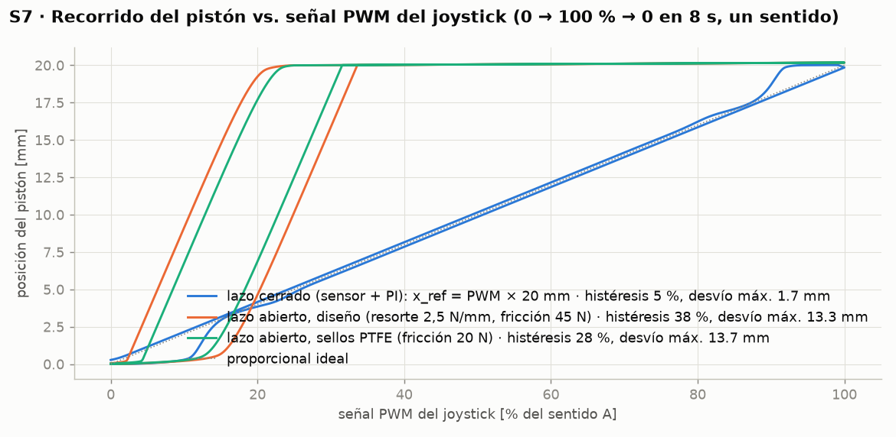
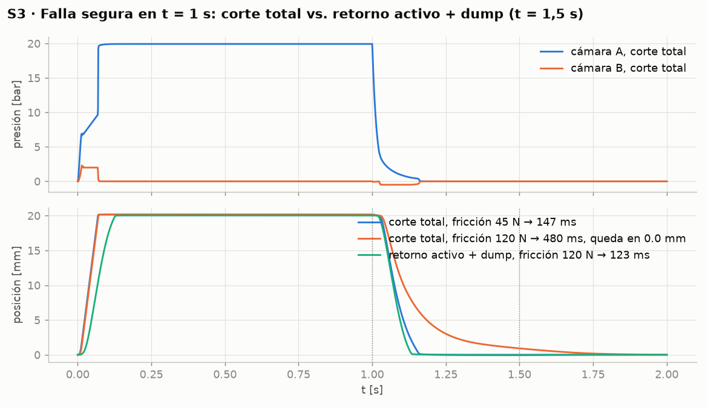
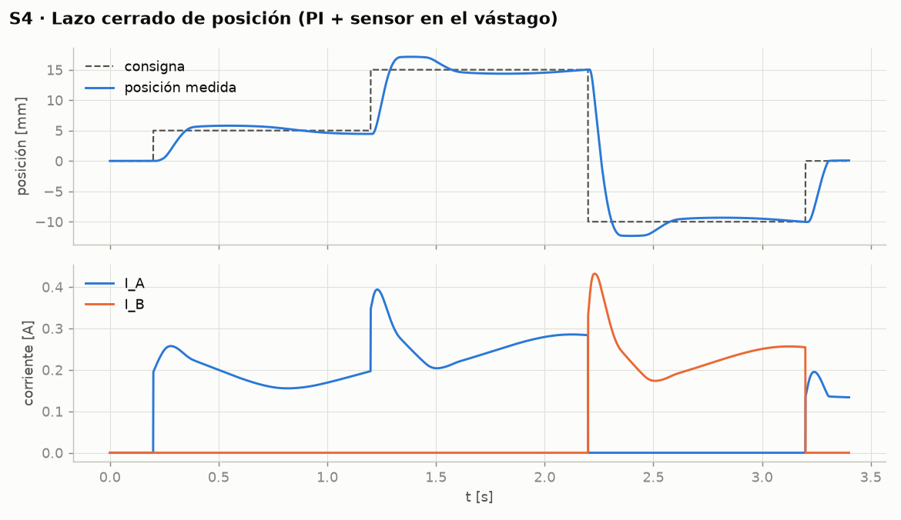
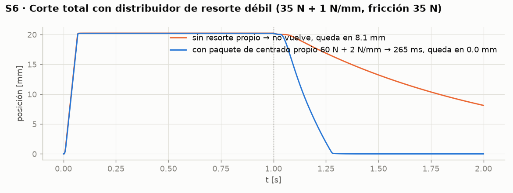

# Nubelink – Simulación, herramientas y compras

*Cómo "pasar a lo seguro" antes de mandar a fabricar el bloque*

Fecha: 2026-09-28 · Complemento de [`nubelink_h1_analisis_y_especificacion.md`](nubelink_h1_analisis_y_especificacion.md)

---

## 1. Dónde está el valor (acordado)

| Se diseña y es tuyo | Se compra (China está bien) | Se manda a fabricar con tu plano |
|---|---|---|
| **Bloque de válvulas** (cavidades, galerías, puertos, integración por sección) | Cartuchos proporcionales, cartuchos del bloque de alimentación, bobinas | Bloque de válvulas (aluminio) y bloque de alimentación (acero) |
| **Integración**: acople a la varilla, lógica de estados, electrónica, puesta a punto | Tubo bruñido Ø32 H8, vástago cromado Ø16 f7, sellos, O-rings, sensores, racores, mangueras | Servopistón (cilindro de doble vástago a medida; en H1 el torno local) |
| **Modelo de simulación validado en banco** (es lo que te deja replicar por modelo de grúa sin volver a probar todo) | Filtro, manómetros, cables, conectores | Soportes y horquillas por modelo de grúa |

---

## 2. Qué simular, con qué, y qué NO vale la pena simular

| Pregunta de diseño | Herramienta | Por qué esa | Qué responde |
|---|---|---|---|
| ¿Responde en < 0,3 s? ¿Cuánta histéresis? ¿Vuelve a neutro solo? ¿Es estable el lazo con sensor? ¿Qué pasa si el carrete está sucio o el pilotaje baja a 15 bar? | **MATLAB/Simulink + Simscape Fluids + Simscape Electrical** (ya tienes MATLAB; verifica con `ver` que estén Simulink, Simscape, Simscape Fluids, Simscape Electrical, Control System Toolbox, Stateflow) | Es la simulación de **sistema**: hidráulica + mecánica + electrónica + control en un solo modelo. Es donde se decide si el diseño funciona | Tiempos de respuesta, zona muerta, histéresis, error del lazo, retorno a neutro, calor, consumo de caudal, tamaño de mangueras |
| Mismo punto, versión "de laboratorio de Danfoss" | **Siemens Simcenter Amesim** (librerías Hydraulic / Hydraulic Component Design) | Es el estándar de los fabricantes de válvulas; permite modelar el carrete de la válvula con sus bordes de mando | Lo mismo que arriba con más fidelidad en la válvula. **No lo compres ahora**: licencia empresarial (decenas de miles de USD) y no cambia la decisión de fabricar el H1 |
| Gratis y suficiente para empezar sin MATLAB | **OpenModelica** (Modelica Standard Library + componentes hidráulicos) o el **modelo Python/MATLAB de esta carpeta** | Cero licencias | Órdenes de magnitud; es lo que ya corre en `sim/` |
| ¿Aguanta el bloque la presión y el apriete de los cartuchos? ¿Se deforman los diámetros de sellado? ¿Qué pared mínima entre galerías? | **SolidWorks Simulation** (estático lineal) — o **Fusion 360 Simulation** (más barato) o **FreeCAD + CalculiX** (gratis) | Análisis estático de un bloque de aluminio a 30–60 bar: cualquier FEA lineal lo resuelve; ANSYS Mechanical es un exceso para esto | Tensión de von Mises, desplazamiento en los asientos de O-ring (< 10 µm), factor de seguridad, pared mínima |
| ¿Pérdida de carga en las galerías Ø8? | **Ninguna** (cálculo a mano) | A 2,4 L/min en Ø8 mm la velocidad es 0,8 m/s y la pérdida es de centésimas de bar; un CFD no aporta nada | Ver §5 |
| ¿Las cavidades? | **Ninguna simulación**: es un problema de **tolerancias**, no de física | La cavidad es el plano del fabricante del cartucho (HYDAC FC08-3 / HydraForce VC08-3); el cartucho trae sus O-rings. Lo que decide es el mecanizado: ±0,02 mm en los diámetros de sellado, Ra ≤ 0,8 µm, coaxialidad, sin rebabas | Se verifica con calibre pasa/no pasa o en una mesa de medición, no en un programa |
| ¿El driver de bobina (PWM, corriente, dither) y la cadena de seguridad? | **Simscape Electrical** (etapa MOSFET + bobina + sensado + PI) y **Stateflow** (máquina de estados: habilitado / manual / paro / pérdida de enlace). Gratis: **LTspice** para la etapa de potencia | Es tu área; el modelo de sistema necesita que el lazo de corriente sea ≤ 5 ms y sin oscilación | Rizado de corriente, respuesta del lazo, comportamiento ante corte |
| ¿Cuánto se calienta el aceite con la contrapresión? | Balance de energía (ya está en `calc/`) o Simscape Thermal Liquid | 25 bar × 60 L/min = 2,5 kW, sólo con radio activa | Si hace falta enfriador (normalmente no, uso intermitente) |

**Lo que ningún programa te da**: la histéresis y zona muerta reales de la válvula, la fuerza real del resorte del carrete con caudal pasando, y la fricción real de los sellos. Esos tres números se **miden en el banco** (ensayos T2–T5 del documento principal) y se cargan en el modelo. El circuito seguro es: **modelo → banco H1 → corregir el modelo → diseñar H2 con el modelo corregido**. Así el H2 modular sale bien a la primera y para cada grúa nueva sólo cambias 3 parámetros (carrera, resorte, paso).

---

## 3. Qué comprar de software (mi recomendación de gasto)

| Necesidad | Opción recomendada | Alternativas | Comentario |
|---|---|---|---|
| CAD 3D + planos + FEA del bloque | **SolidWorks Standard + SolidWorks Simulation Standard** (licencia perpetua vía distribuidor + mantenimiento anual) | **Fusion 360** (suscripción anual, incluye simulación estática; muchísimo más barato) · **FreeCAD** (gratis; FEA con CalculiX) | Los talleres chinos de manifolds trabajan con STEP + PDF; cualquiera de los tres los genera. Si el presupuesto es limitado, Fusion 360 hace todo lo que este proyecto necesita |
| Simulación de sistema hidráulico-electrónico | **MATLAB + Simulink + Simscape + Simscape Fluids + Simscape Electrical** | Simcenter Amesim (más fidelidad, mucho más caro) · OpenModelica (gratis) | Si tu licencia "todo" ya incluye Simscape Fluids, no gastes nada más |
| Siemens NX / Solid Edge / Simcenter 3D | No | — | Son herramientas de gran empresa; no aportan nada frente a SolidWorks/Fusion para un bloque de aluminio |
| ANSYS (Mechanical, Fluent) | No por ahora | Ansys Discovery (más barato) si más adelante quieres CFD de las galerías del H2 | A 30 bar y 2 L/min no hay nada que un CFD cambie |
| Electrónica de potencia | Simscape Electrical (ya cubierto) | LTspice (gratis), KiCad para el PCB | — |

---

## 4. Modelo de sistema: lo que ya corre y cómo pasarlo a Simscape

### 4.1 El modelo de esta carpeta (`sim/`)

`sim/servopiston_model.py` y su gemelo `sim/servopiston_model.m` son el mismo modelo de parámetros concentrados:

```
joystick → lazo de corriente (τ 3 ms, dither 150 Hz) → holgura de la válvula (histéresis 4 %)
        → consigna de presión p = K·(I − I0), retardo del carrete τ 15 ms
        → caudal reductor-relevador Q = G·(p_ref − p_cámara), saturado a 12 L/min
        → cámaras A/B con compresibilidad (V0 = 60 cm³ con manguera, β = 8·10⁸ Pa)
        → pistón 603 mm², 0,8 kg, fricción Coulomb 45 N + viscosa, topes ±20 mm
        → resorte del carrete 60 N + 8 N/mm (referido a la horquilla)
        → (opcional) PI de posición con sensor
```

`sim/run_scenarios.py` corre ocho escenarios (≈ 30 s) y deja figuras y un resumen en `sim/out/`. Los parámetros marcados **SUPUESTO** en el código son exactamente los que el banco H1 debe medir.

#### Resultados con los parámetros de partida
Parámetros: pistón Ø32/Ø16 (603 mm²), carrera ±20 mm, válvula 0–20 bar / 12 L/min, pilotaje 25 bar,
resorte del carrete 60 N + 8 N/mm (SUPUESTO), resorte propio del módulo 50 N + 2,5 N/mm, fricción 45 N (SUPUESTO), I_max 1,0 A, zona muerta 0,12 A.

| Escenario | Resultado |
|---|---|
| S1 lazo abierto: posición a 0,3 / 0,6 / 1,0 A | 9.0 / 20.1 / 20.2 mm (tope 20 mm): **satura desde 0,3 A** |
| S1 tiempo al 90 % del primer escalón | 363 ms |
| S1 retorno a neutro al soltar (90 %) | 136 ms |
| S2 histéresis en lazo abierto, sin / con dither | 46 % / 41 % de la carrera (domina fricción/rigidez, no la válvula) |
| S3 corte total, fricción 45 N | vuelve a |x| < 1 mm en 147 ms, posición final 0.00 mm |
| S3 corte total, fricción 120 N (carrete sucio) | 480 ms, **queda en 0.0 mm** |
| S3b retorno activo (lazo cerrado a 0) y dump a los 0,5 s, fricción 120 N | vuelve en 123 ms, posición final -0.00 mm |
| S4 lazo cerrado: error estacionario máx. / t90 del escalón de 10 mm | 0.47 mm / 94 ms |
| S5 lazo abierto, corriente de arranque → tope, base | 0.25 → 0.43 A |
| S5 con fricción 120 N | 0.30 → 0.48 A |
| S5 con pilotaje 15 bar | 0.25 → 0.43 A |
| S6 resorte débil (35 N + 1 N/mm), corte total, sin resorte propio | no vuelve, queda en 8.1 mm |
| S6 ídem con paquete de centrado propio 60 N + 2 N/mm | 283 ms, queda en 0.0 mm |
| S7 PWM → posición, lazo cerrado | histéresis 5 %, desvío máx. respecto a la recta 1.7 mm |
| S7 PWM → posición, lazo abierto (diseño) | histéresis 38 %, desvío máx. 13.3 mm |
| S7 PWM → posición, lazo abierto con sellos PTFE (20 N) | histéresis 28 %, desvío máx. 13.7 mm |
| Modo manual a 0,1 m/s, sin resorte propio | 3.6 L/min, Δp 0.60 bar → 36 N hidr. + 45 N fricción = **81 N** extra en la horquilla |
| Modo manual a 0,1 m/s, con resorte propio 50 N + 2,5 N/mm (diseño) | 36 + 45 + 100 N (resorte a tope) = **181 N** extra en la horquilla |

#### Fuerza extra en modo manual según el resorte propio (a 0,1 m/s, a fin de carrera; palanca con relación 3)

| Resorte propio | Fricción | Extra en la horquilla | Extra en la empuñadura |
|---|---|---|---|
| 0 N + 0.0 N/mm | 45 N | 81 N | 27 N |
| 0 N + 0.0 N/mm | 20 N | 56 N | 19 N |
| 50 N + 2.5 N/mm | 45 N | 181 N | 60 N |
| 50 N + 2.5 N/mm | 20 N | 156 N | 52 N |
| 60 N + 4.0 N/mm | 45 N | 221 N | 74 N |
| 60 N + 4.0 N/mm | 20 N | 196 N | 65 N |
| 80 N + 8.0 N/mm | 45 N | 321 N | 107 N |
| 80 N + 8.0 N/mm | 20 N | 296 N | 99 N |

#### Conclusiones de diseño

1. **El lazo abierto (presión ∝ corriente, sin sensor) no sirve** con un pistón de 1 200 N sobre un resorte de carrete de
   decenas de N: toda la carrera cabe en 0,1–0,2 A de corriente y la histéresis es del orden de la mitad de la carrera. No es
   un problema de la válvula ni del dither: es fricción / rigidez del resorte. Por eso el MOD10 lleva realimentación mecánica.
2. **Con sensor de posición y lazo PI el módulo posiciona a ≈ ±0,5 mm en menos de 100 ms**, usando el empuje sobrante para vencer la
   fricción. El sensor no es "fase 2": es parte del diseño.
3. **Retorno a neutro**: el paquete de resorte propio (50 N + 2,5 N/mm, obligatorio) devuelve el pistón a neutro en ~0,3 s
   aunque el distribuidor tenga resorte débil o el carrete esté sucio (S6). Además, con energía, la secuencia "retorno activo
   en lazo cerrado → dump 0,5 s después" lo hace más rápido y verifica el neutro con el sensor (S3b).
4. **PWM → posición (S7)**: con el lazo cerrado el recorrido es proporcional a la señal del joystick (desvío < 1 mm). En lazo
   abierto la curva es una S con histéresis grande; sólo con fricción muy baja y resortes más rígidos se acerca a la recta,
   y eso encarece el modo manual (tabla de fuerzas). Conclusión: la proporcionalidad la da el lazo; el resorte, la seguridad.
5. **Modo manual**: el resorte de diseño cuesta ~100 N más en la horquilla a fin de carrera (≈ 35 N en la empuñadura con
   relación de palanca 3). Bajar la fricción (PTFE) importa tanto como el resorte.
6. La presión de pilotaje (15 vs 25 bar) casi no cambia nada; la fricción sí. **Prioridad del banco: medir y minimizar fricción**
   (sellos PTFE en pistón y vástago).

Figuras: S1_escalones.png · S2_histeresis.png · S3_falla_segura.png · S4_lazo_cerrado.png · S5_sensibilidad.png · S6_resorte_debil.png · S7_pwm_posicion.png










### 4.2 Blueprint Simscape Fluids (dominio *Isothermal Liquid*)

| Subsistema | Bloques | Parámetros de partida |
|---|---|---|
| Fluido | `Isothermal Liquid Properties` | ISO VG 46 a 40 °C, módulo 1,5 GPa, aire 0,5 % |
| Alimentación (nivel 1) | `Pressure Source (IL)` 25 bar + `Local Restriction (IL)` (filtro) | Suficiente para el módulo |
| Alimentación (nivel 2, bloque completo) | `Fixed-Displacement Pump (IL)` (40–60 L/min) → `Pressure Relief Valve (IL)` 25 bar como contrapresión, con `2-Way Directional Valve (IL)` NA en el venteo → `Pressure-Reducing Valve (IL)` 25 bar → `Pressure Relief Valve (IL)` 40 bar → `Reservoir (IL)` | Sirve para ver el calor, el retardo al cerrar el venteo y el pico al abrirlo |
| Válvula proporcional (nivel 1, señal) | `Simulink-PS Converter` → `PS Lag` (τ 15 ms) → `Pressure-Reducing 3-Way Valve (IL)`… la consigna de este bloque es fija, así que en nivel 1 se modela la válvula como en Python: consigna de presión → `Variable Orifice (IL)` P→A y A→T mandados por (p_ref − p_A) | Reproduce el modelo Python dentro de Simscape |
| Válvula proporcional (nivel 2, física) | Carrete: `Mass` + `Translational Spring` + `Translational Damper`; fuerza del solenoide: `Solenoid` (Simscape Electrical) o `Ideal Force Source` = k·I; realimentación de presión: `Translational Mechanical Converter (IL)` conectado al puerto A (área del carrete); bordes de mando: dos `Variable Orifice (IL)` (P→A, A→T) con área vs. posición del carrete | Es el modelo que hace Amesim; con la ficha HYDAC (área de realimentación, resorte, fuerza vs corriente) queda calibrado |
| Mangueras | `Pipe (IL)` Ø6 mm × 1 m entre válvula y pistón, con compliance de pared | Es lo que más frena la respuesta; probar Ø4 y Ø8 |
| Servopistón | `Double-Acting Actuator (IL)` (áreas 603 mm² ambas caras, volumen muerto 20 cm³ por cámara, topes ±20 mm) + `Mass` 0,8 kg + `Translational Friction` (rotura 55 N, Coulomb 45 N, viscosa 300 N·s/m) | Del CAD `nubelink_h1.py` |
| Carga (carrete del distribuidor) | `PS Lookup Table (1D)` → `Ideal Force Source`: F(x) = 60·sign(x) + 8000·x (precarga + rigidez), o dos `Translational Spring` precargadas contra `Translational Hard Stop` | **Medir** en la grúa |
| Sensor y lazo | `Ideal Translational Motion Sensor` → `PS-Simulink` → PI discreto 1 kHz → corrientes A/B | Kp 0,015 A/mm, Ki 0,25 A/(mm·s) de partida |
| Electrónica | `DC Voltage Source` 24 V → `MOSFET` + `PWM Generator` 200 Hz → bobina `Resistor`+`Inductor` (medir R y L de la bobina 24PG) → `Current Sensor` → PI de corriente + `Sine Wave` 150 Hz (dither) | Lazo de corriente ≤ 5 ms |
| Seguridad | `Stateflow`: estados MANUAL / REMOTO / PARO; transiciones por selector, paro de emergencia, pérdida de enlace > 0,5 s, "no vuelve a neutro" | La salida `habilitado` corta venteo y bobinas |
| Solver | `ode23t` o `ode15s`, paso máx. 1e-4 s, tolerancia relativa 1e-4 | El sistema es rígido por la compresibilidad |

Validación: el modelo Simscape debe reproducir los ensayos T2 (fricción), T3 (presión vs corriente), T4 (posición vs corriente) y T5 (escalón) del banco con error < 15 %. Después se congela y se usa para el H2.

---

### 4.2b Estudio paramétrico para lazo abierto (`sim/estudio_lazo_abierto.py`)

Como la primera versión será en lazo abierto (corriente ∝ PWM, sin sensor), se buscó la combinación pistón / resorte propio / sellos que minimiza la histéresis manteniendo una fuerza manual aceptable, para dos distribuidores extremos:

Rampa de PWM 0 → 100 % → 0 en 8 s; corriente = I0 + PWM·(I_max − I0); válvula 0–20 bar; pilotaje 25 bar; fricción escalada con el perímetro de sellado (referencia Ø32/Ø16).

| Pistón | Resorte propio | Sellos | Fricción (N) | Distribuidor débil: hist. / I_ini → I_fin | Distribuidor fuerte: hist. / I_ini → I_fin | F extra manual a tope (N) |
|---|---|---|---|---|---|---|
| Ø20/Ø10 | 2,5 N/mm | PTFE 20 N | 12 | 38 % / 0.31 → 0.46 A | 10 % / 0.36 → 0.75 A | 118 |
| Ø20/Ø10 | 2,5 N/mm | PU 40 N | 25 | 47 % / 0.33 → 0.49 A | 16 % / 0.38 → 0.77 A | 131 |
| Ø20/Ø10 | 4 N/mm | PTFE 20 N | 12 | 26 % / 0.31 → 0.51 A | 9 % / 0.36 → 0.80 A | 148 |
| Ø20/Ø10 | 4 N/mm | PU 40 N | 25 | 38 % / 0.33 → 0.53 A | 14 % / 0.38 → 0.82 A | 161 |
| Ø20/Ø10 | 6 N/mm | PTFE 20 N | 12 | 17 % / 0.30 → 0.56 A | 7 % / 0.35 → 0.85 A | 178 |
| Ø20/Ø10 | 6 N/mm | PU 40 N | 25 | 26 % / 0.31 → 0.58 A | 12 % / 0.36 → 0.88 A | 191 |
| Ø25/Ø12 | 2,5 N/mm | PTFE 20 N | 15 | 46 % / 0.25 → 0.36 A | 16 % / 0.28 → 0.52 A | 130 |
| Ø25/Ø12 | 2,5 N/mm | PU 40 N | 31 | 48 % / 0.26 → 0.38 A | 23 % / 0.29 → 0.54 A | 145 |
| Ø25/Ø12 | 4 N/mm | PTFE 20 N | 15 | 38 % / 0.25 → 0.38 A | 13 % / 0.28 → 0.56 A | 160 |
| Ø25/Ø12 | 4 N/mm | PU 40 N | 31 | 46 % / 0.26 → 0.40 A | 19 % / 0.29 → 0.58 A | 175 |
| Ø25/Ø12 | 6 N/mm | PTFE 20 N | 15 | 26 % / 0.24 → 0.41 A | 11 % / 0.27 → 0.59 A | 190 |
| Ø25/Ø12 | 6 N/mm | PU 40 N | 31 | 36 % / 0.25 → 0.43 A | 16 % / 0.28 → 0.61 A | 205 |
| Ø32/Ø16 | 2,5 N/mm | PTFE 20 N | 20 | 49 % / 0.21 → 0.31 A | 28 % / 0.23 → 0.39 A | 156 |
| Ø32/Ø16 | 2,5 N/mm | PU 40 N | 40 | 49 % / 0.22 → 0.32 A | 36 % / 0.24 → 0.41 A | 176 |
| Ø32/Ø16 | 4 N/mm | PTFE 20 N | 20 | 46 % / 0.21 → 0.32 A | 23 % / 0.23 → 0.41 A | 186 |
| Ø32/Ø16 | 4 N/mm | PU 40 N | 40 | 49 % / 0.22 → 0.33 A | 31 % / 0.24 → 0.43 A | 206 |
| Ø32/Ø16 | 6 N/mm | PTFE 20 N | 20 | 40 % / 0.20 → 0.33 A | 19 % / 0.22 → 0.43 A | 216 |
| Ø32/Ø16 | 6 N/mm | PU 40 N | 40 | 46 % / 0.22 → 0.34 A | 26 % / 0.24 → 0.45 A | 236 |

Segunda pasada (válvula 0–14 vs 0–20 bar, resorte 6 vs 8 N/mm, histéresis propia de la válvula 2 vs 4 %): con 0–14 bar el distribuidor fuerte no llega a fin de carrera; 8 N/mm baja la histéresis a 10–12 % pero sube la fuerza manual a ~220 N en la horquilla; la histéresis propia de la válvula influye poco (±2 %).

**Elección H1‑B: Ø20/Ø10 · resorte 40 N + 6 N/mm · sellos PTFE · PDR08‑01 0–20 bar** → histéresis 7 % (distribuidor fuerte) / 17 % (débil), banda de corriente 0,30–0,85 A, fuerza manual extra ≈ 178 N en la horquilla (≈ 60 N en la empuñadura).

### 4.3 Cadena de señal: del PWM del joystick al recorrido del pistón

Hay **dos PWM distintos** y conviene no mezclarlos:

| PWM | Quién lo genera | Qué significa | Frecuencia |
|---|---|---|---|
| **PWM de mando** (joystick) | Tu receptor de radio, uno por sentido (A y B), como hoy para Hiab/Palfinger | *Cuánto* quiere moverse el operador: 0–100 % = 0–20 mm (o 0–13 mm) de recorrido en ese sentido | La de tu receptor (típ. 100–500 Hz) |
| **PWM de potencia** (bobina) | El driver de corriente del módulo | El ciclo de trabajo que hace falta para que circule la **corriente** que pide el lazo; no lo fija el joystick | 100–200 Hz sobre la bobina (o según ficha) + dither |

Cadena recomendada (es lo que simula S7 en lazo cerrado):

```
PWM joystick A (0–100 %) ──► x_ref = D·20 mm ──► PI de posición (1 kHz) ──► consigna de corriente I_A
                                     ▲                                             │
                             sensor de posición                                    ▼
                                     │                                  driver de corriente (PWM 24 V + dither)
                                     └──────────── pistón ◄── presión en A ◄── bobina V_A
```

* **La bobina no "se alimenta a 24 V y ya"**: es una bobina de solenoide proporcional que se controla **en corriente**. 24 V es la tensión nominal de la bobina (código 24PG); el driver conmuta la tensión del camión (20–30 V con motor en marcha) con PWM y ajusta el ciclo de trabajo hasta medir la corriente de consigna (0 → I_max, p. ej. 0,12 → 1,0 A; el valor exacto lo da la ficha de la bobina). Con la bobina caliente la resistencia sube ~40 % y el driver sube el ciclo de trabajo solo; con 30 V baja el ciclo. Por eso la posición no depende de la tensión de la batería.
* **La proporcionalidad la da el lazo de posición**, no la bobina: en lazo abierto (corriente ∝ PWM del joystick) la curva es una S con 30–40 % de histéresis (S7), por más dither que se ponga. Con el sensor, recorrido ∝ PWM con desvío < 2 mm y sin histéresis apreciable.
* **Un sentido por válvula**: PWM A > 0 ⇒ sólo V_A recibe corriente; PWM B > 0 ⇒ sólo V_B. Nunca las dos a la vez (enclavamiento en el driver).
* **Dónde vive el lazo**: o en el firmware de tu receptor (entrada de sensor + PI por función) o en una **tarjeta de control Nubelink** por bloque (un microcontrolador para 4–6 funciones: lee los PWM del receptor, los sensores, cierra los lazos, maneja los drivers de corriente, el venteo y la máquina de estados de seguridad). La tarjeta es lo que hace al bloque independiente de la marca de radio.
* **Resorte de centrado obligatorio** (50 N + 2,5 N/mm de partida): garantiza el neutro sin energía. El lazo lo usa como carga conocida; el PI compensa su fuerza sin que el operador lo note.

## 5. Cálculos "a mano" que sustituyen a un CFD/FEA

| Cálculo | Resultado | Conclusión |
|---|---|---|
| Velocidad en galería Ø8 a 2,4 L/min | 0,8 m/s | Laminar (Re ≈ 130 con VG46 a 40 °C) |
| Pérdida de carga en 100 mm de galería Ø8 | ≈ 0,02 bar | Despreciable frente a 20 bar |
| Pérdida en manguera ¼" (Ø6) × 1 m a 2,4 L/min | ≈ 0,15 bar | Despreciable; la manguera importa por su **compliance** (retardo), no por la pérdida |
| Tensión en pared entre galería P (Ø8, 30 bar) y cavidad, pared 4 mm, aluminio 6082-T6 (σy 250 MPa) | σ ≈ p·r/t = 3 MPa × 4/4 = 3 MPa | FS > 80 |
| Bloque de alimentación en acero (S355, σy 355 MPa) con galería Ø10 a 350 bar y pared 8 mm | σ ≈ 35 × 5/8 ≈ 22 MPa | FS ≈ 16; en acero se puede ir a pared 5 mm |
| Apriete del cartucho SAE-08 (3/4-16 UNF, ~45 N·m) sobre rosca en aluminio | F ≈ T/(0,2·d) ≈ 45/(0,2·0,019) ≈ 12 kN sobre 17 mm de rosca | Tensión de cizalla en los filetes de aluminio ≈ 12 000/(π·19·17·0,5) ≈ 24 MPa ≪ 150 MPa | OK; usar el par que indica HYDAC, no más |
| Tornillos de fijación M8 8.8 (4 uds) | Precarga ≈ 10 kN c/u | Sobrados para un bloque de 0,6 kg con mangueras |

El FEA en SolidWorks se hace igualmente **una vez**, para el bloque de alimentación en acero (350 bar) y para el H2 modular (galerías pasantes con O-ring entre secciones, tirantes): ahí sí hay tensiones de contacto y flexión que no se estiman a mano.

---

## 6. Compras y fabricación en China (qué pedir y cómo pedirlo)

### 6.1 Cartuchos

| Ítem | Original (H1) | Equivalente chino (H2 / serie, tras validar en banco) | Términos de búsqueda / notas |
|---|---|---|---|
| Válvula proporcional 3 vías 0–20 bar, ×2 por función | **HYDAC PDR08‑01‑C‑N‑30‑24PG** (12 L/min, 350 bar, FC08‑3) | Cartuchos "tipo HydraForce" **EHPR98‑T38 / TS08‑36** de fabricantes como AAK Industry, o los listados en Made‑in‑China/Alibaba como *proportional pressure reducing/relieving cartridge valve 3‑way* | Pedir siempre **rango de presión regulada** (0–20 o 0–35 bar), histéresis (< 5 %), fuga interna y curva presión–corriente. Comprar 2 chinas + 2 HYDAC y compararlas en el banco (ensayo T3) antes de decidir la serie |
| Alternativa *drop‑in* (brida, no cartucho roscado) | HydraForce **EHPR98‑T38** (control 0–30 bar a corriente máx., 18,9 L/min, alimentación máx. 34,5 bar) o **EHPR98‑T35** (0–20,7 bar, 5,7 L/min) | Clones chinos *EHPR98‑T38 type* muy difundidos (son las válvulas piloto de los distribuidores proporcionales) | Van alimentadas desde la línea reducida de 25–30 bar (máx. 34,5 bar), exactamente nuestra arquitectura. Cambia la cavidad: alojamiento de brida en vez de FC08‑3; decidir antes de dibujar el bloque H2 |
| Cuerpo en línea para el H1 (si no fabricas aún el bloque) | HYDAC **FH083‑AB3** (aluminio, G3/8, 210 bar, ref. 3011427) | *SAE‑08 3‑way cartridge valve line body aluminum G3/8* | — |
| Contrapresión: alivio pilotado venteable ≥ 100 L/min, 350 bar, 20–25 bar | Sun *solenoid‑operated ventable relief* / HydraForce tipo RV12‑2x con venteo | *pilot operated relief cartridge valve with vent port SAE‑12 / SAE‑16* | Verificar que el venteo baje la presión a < 5 bar |
| Electroválvula de venteo 2/2 NA 24 V, SAE‑08 | HydraForce SV08‑20 NA o equivalente | *SV08‑20 normally open solenoid cartridge valve 24V* | Caudal pequeño; cualquiera sirve |
| Reductora fija 3 vías 350 → 25 bar, SAE‑08 | HydraForce PR08‑30 / Sun PRDB o equivalente | *PR08‑30 pressure reducing relieving cartridge* | Ajustable 10–50 bar |
| Alivio 35–40 bar SAE‑08 | RV08‑20 tipo | *RV08‑20 relief cartridge* | Ajustable |
| Filtro de presión 10 µm, 350 bar, ¼" | HYDAC / Parker inline | *high pressure inline hydraulic filter 10 micron 1/4 BSP* | β ≥ 75 |

### 6.2 Bloques (lo que mandas a fabricar con tu STEP + plano)

**Primer bloque de prueba = H1‑B integrado** (`cad/out/nubelink_h1b_comando_bloque.step`, hoja en [`hoja_fabricacion_h1b.md`](hoja_fabricacion_h1b.md)). Proceso: **CNC en aluminio 6061‑T6** (JLCPCB CNC, PCBWay, Xometry o un taller chino de manifolds). **No SLM / impresión en metal**: porosidad (fugas), rugosidad interna, distorsión, y de todos modos hay que mecanizar camisa, cavidades y caras de sellado; sale más caro y con más riesgo.

| Ítem | Material | Qué enviar al taller | Qué exigir | Costo orientativo |
|---|---|---|---|---|
| **Bloque de válvulas H1** (2 cavidades) y luego **sección H2** (por función) | Aluminio **6082‑T6 o 7075‑T6**, anodizado | `cad/out/nubelink_h1_bloque_valvulas.step` + plano PDF con cotas, roscas G1/4 (ISO 1179‑1), **cavidad "SAE‑08 3‑way common cavity (HydraForce VC08‑3 / HYDAC FC08‑3)"** — el taller tiene la herramienta de forma | Diámetros de sellado ±0,02 mm, Ra ≤ 0,8 µm en cavidad, sin rebabas en cruces de galerías, **lavado y tapado**, ensayo de presión 60 bar 5 min, informe dimensional de la cavidad | USD 60–150 / pieza en lotes de 5–10 (búsqueda: *custom hydraulic manifold block aluminum cartridge valve cavity machining*) |
| **Bloque de alimentación** | Acero **S355 / 1045**, zincado o fosfatado | STEP + plano, cavidades SAE‑12/16 + SAE‑08 según cartuchos elegidos, puertos G3/4 y G1/4 | Ensayo 1,5 × 350 = 525 bar en la parte de alta; limpieza | USD 100–250 / pieza |
| Servopistón (H2 en adelante) | Cuerpo acero, vástago cromado | `cad/out/nubelink_h1_ensamble.step` como cilindro a medida: *custom double rod hydraulic cylinder bore 32 rod 16 stroke 40 mm, ports G1/4, low friction PTFE piston seal* | Camisa Ø32 H8 bruñida Ra 0,4, vástago Ø16 f7 cromo ≥ 20 µm, fricción de arranque < 40 N (pedir que lo midan), ensayo 60 bar | USD 60–120 / unidad en lotes |

### 6.3 Componentes sueltos para el H1 (torno local + compras)

| Ítem | Especificación | Búsqueda |
|---|---|---|
| Tubo bruñido | ST52 / E355, **ID 32 H8 × OD 42**, 1 m | *honed tube 32x42 ST52 H8* |
| Vástago | **Ø16 f7** cromo duro, 1 m (o inox 431 pulido) | *hard chrome plated piston rod 16 mm f7* |
| Sello de pistón | Aro PTFE + O‑ring (glyd ring) para Ø32, doble efecto | *glyd ring 32 piston seal PTFE double acting* |
| Sello de vástago | PU 16 × 24 × 5,5 (o según catálogo) | *rod seal 16x24x5.5 polyurethane* |
| Guardapolvo | 16 × 22 × 5 | *wiper seal 16x22x5* |
| O‑rings de tapa | 52 × 3 NBR 70 | — |
| Sensor de posición | Potenciómetro lineal 50 mm (KTC/KTR) o sensor Hall lineal | *linear potentiometer position sensor 50mm KTC* |
| Bobina/conector | Según cartucho (HYDAC 24PG + conector DIN) | — |

Compra de sellos: para el H1 vale la pena que sean de marca (Hallite, Trelleborg, Parker, Freudenberg) porque la **fricción** es el parámetro crítico del modo manual; los chinos se prueban en el H2 con el mismo ensayo T2.

---

## 7. Secuencia "pasar a lo seguro"

1. **Ahora**: correr `sim/run_scenarios.py` (o el `.m`) con tus números en cuanto midas el resorte y la carrera en la primera grúa → confirma pistón y rango de válvula.
2. **Semana 1–2**: pedir 2 HYDAC + 2 cuerpos en línea (o el bloque chino de 2 cavidades) + tubo/vástago/sellos; el torno local hace el H1.
3. **Semana 3–6**: banco H1, ensayos T1–T9; alimentar el modelo Simscape con T2–T5.
4. **Semana 6–8**: FEA del bloque de alimentación y de la sección H2 en SolidWorks/Fusion; mandar a fabricar 1 bloque de alimentación + 4 secciones H2 + 4 servopistones a China.
5. **Semana 10–14**: montaje en la primera grúa (sin carga → con carga), con selector manual/remoto y cadena de paro.

Cada grúa nueva después de eso: medir 3 números, correr el modelo, cortar soportes en la 6090.
